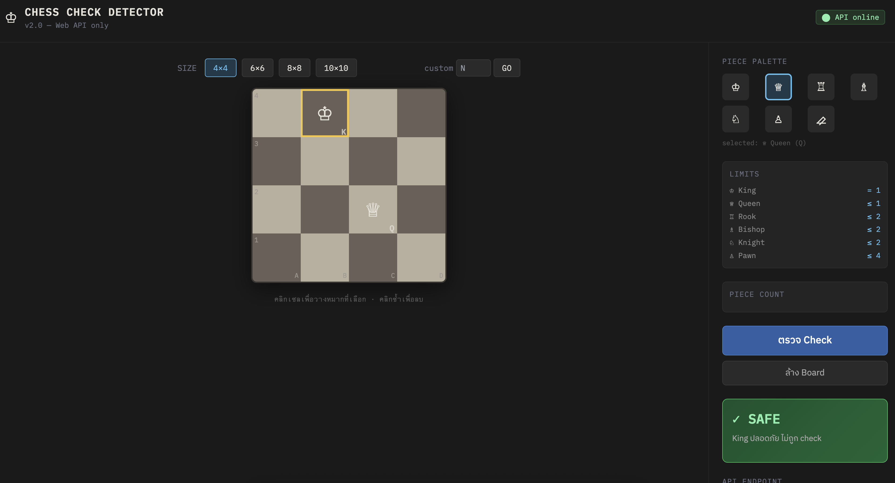
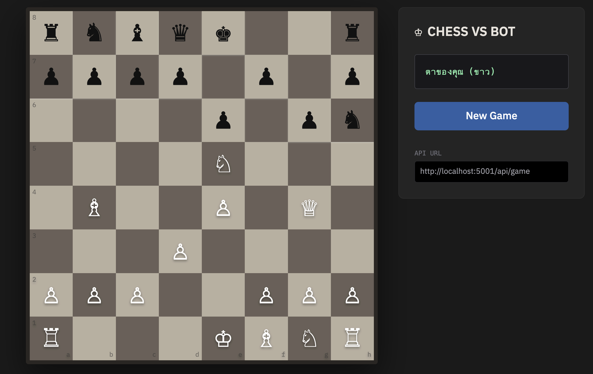

# ♟️ Discovery-Piscine-Python: Chess AI & Web Integration
### "Don't just code, build the logic." — 42 Bangkok

ยินดีต้อนรับสู่ Repository รวบรวมโปรเจกต์จากการเรียน **Discovery Piscine - Python Edition** ที่ 42 Bangkok โปรเจกต์นี้ไม่ใช่แค่การทำตามโจทย์ แต่เป็นการก้าวข้ามขีดจำกัดด้วยการสร้าง **Chess Engine** ที่คำนวณด้วย Logic จริงและเชื่อมต่อผ่านระบบ Web API

---

## 📸 Project Showcase

*(คำแนะนำ: เซฟรูปหน้าจอโปรแกรมของคุณชื่อ `chess-demo.png` ไว้ในโฟลเดอร์เดียวกับไฟล์นี้ รูปจะโชว์ทันที)*

---

## 🚀 สิ่งที่ได้เรียนรู้ (The Journey)
การเรียนที่ 42 ไม่ใช่การหาคำตอบจาก Google แต่คือการ "ใช้สมอง" แก้ปัญหาเอง สิ่งที่ผมได้ตกตะกอนจากแคมป์นี้คือ:

* **Advanced Data Structures:** การจัดการ `List` และ `Array` ในรูปแบบ 2 มิติ เพื่อสร้างกระดานหมากรุกที่ไม่จำกัดแค่ 8x8 แต่เป็น $N \times N$
* **AI Algorithm:** การเขียน **Minimax Algorithm** ร่วมกับ **Alpha-Beta Pruning** เพื่อให้ AI สามารถคิดล่วงหน้าและหาตาเดินที่ดีที่สุด (Best Move)
* **Web API Architecture:** การเชื่อมต่อฝั่ง Frontend (HTML/Tailwind) เข้ากับ Backend (Python) เพื่อสร้างระบบที่ใช้งานได้จริงบน Browser
* **Teamwork & Logic:** การทำงานร่วมกับเพื่อนในทีมเพื่อถอดรหัสกฎหมากรุกสากล และหาวิธีการตรวจเช็ก **Checkmate** ที่ซับซ้อน

---

## ✨ Features (ความสามารถของโปรเจกต์)
* ✅ **Custom Board Size:** รองรับตารางขนาด 8x8 หรือขนาดอื่นๆ ตามต้องการ
* ✅ **Checkmate Detector:** ระบบคำนวณการรุก (Check) และการจน (Checkmate) ที่แม่นยำ
* ✅ **AI Opponent:** AI ที่เล่นด้วยได้จริง และสามารถชนะผู้เล่นที่เป็นมนุษย์ได้ด้วยการคำนวณ Logic
* ✅ **Web Interface:** หน้าตาเว็บไซต์สวยงามด้วย Tailwind CSS เชื่อมต่อ API เพื่อประมวลผล

---